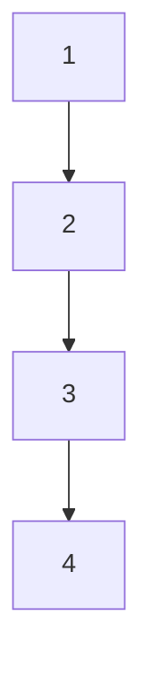

# Implementação de um algoritmo adaptativo para otimização de condições de avaliação na Robótica Adaptativa

Implementação de funções de otimização de condições para os ambientes de controle robótico CartPolev-1 e PendulumV-1 [1]. 


## Documentation

[Documentation](https://github.com/Brenda-Machado/otimizacao-condicoes-avaliacao/wiki)


## Experimentos

Como descrito em mais detalhes na seção 3. Metodologia do documento do TCC, experimentos serão realizados para realizar diversas otimizações possíveis nas condições de avaliação dos ambientes testados. Esses experimentos são descritos brevemente a seguir:

+ Experimento controle: agente treinado com todas as possíveis condições iniciais. Esse teste tem como objetivo ter uma visão mais real da fitness, que seria alcançada se fosse possível percorrer para cada agente todas as possibilidades de condições iniciais;

+ Experimento 1: modificar a quantidade de episódios de avaliação, isto é, o agente foi colocado em N avaliações com N posições iniciais diferentes, medindo seu comportamento médio;

+ Experimento 2: variar a duração do episódio de avaliação, isto é, o tempo em que o agente ficará no interagindo e sendo avaliado no ambiente;

+ Experimento 3: modificou-se a variação do ruído a ser adicionado ao motor do agente;

+ Experimento 4: alterar o intervalo das condições iniciais para serem inicializadas com valores aleatórios entre [x,y];

+ Experimento 5: avaliação do peso que a fitness de cada episódio avaliativo tem, considerando que por padrão é feito uma média para retirar a fitness final de cada avaliação. Os testes consistiram em considerar a maior e a menor fitness como a final;

+ Experimento 6: modificou-se o peso das componentes da fitness, atribuindo-se um valor entre 0 e 1 para o quanto cada uma das fitness (a maior, a média e a menor) influenciaria na fitness final.
## Roadmap

    1. Implementar as otimizações/experimentos descritos no TCC;
        - CartPole V-1;
        - Pendulum V-1.

    2. Análise dos resultados obtidos através de vários plots;
    3. Proposta de um algoritmo que realize a otimização automática;
    4. Próximos passos... 


## Authors

- [@Brenda-Machado](https://www.github.com/Brenda-Machado).


## Referências principais de implementação

[1] - [Gymnasium - Farama Foundation](https://github.com/Farama-Foundation/Gymnasium);

[2] - ...

## Citação

Trabalho de Conclusão do curso de Ciência da Computação na Universidade Federal de Santa Catarina.

```
@article{otimizacaoCondicoesAvaliacao2025,
title={Implementação de um algoritmo adaptativo para otimização de condições de avaliação na Robótica Adaptativa},
author={Machado, Brenda},
journal={...},
year={2025}
}
```
